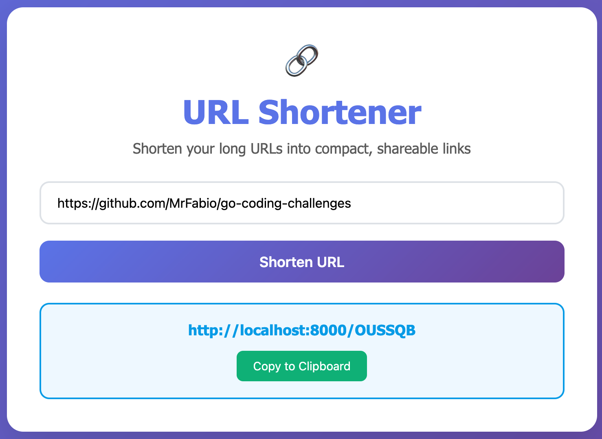
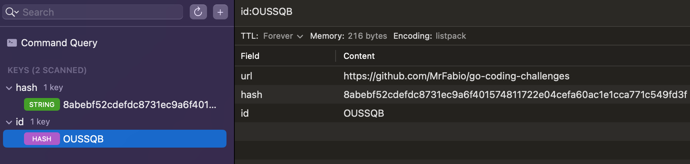

# URL Shortener

A flexible URL shortening service with a generic database interface, built as part of the [codingchallenges.fyi](https://codingchallenges.fyi/challenges/challenge-url-shortener) challenge.


*The main web page showing the URL shortening interface*

## Features

- **Generic Database Interface**: Plug-and-play database implementations
- **In-Memory Storage**: Fast, temporary storage using Go maps
- **Redis Storage**: Persistent storage with Redis backend
- **URL Deduplication**: Prevents duplicate URLs using SHA256 hashing
- **Random ID Generation**: 6-character alphanumeric short IDs
- **CRUD Operations**: Add, get, delete, and count entries
- **Clean Architecture**: Well-organized code with separated concerns
- **Input Validation**: URL validation and normalization

## Project Structure

``` yaml
url-shortener/
├── api/              # All application logic (flat structure)
│   ├── config.go     # Configuration management
│   ├── handlers.go   # HTTP request handlers
│   ├── models.go     # Data structures and request/response models
│   ├── server.go     # Server setup and routing
│   └── validation.go # Input validation logic
├── db/               # Database implementations
│   ├── in_mem/       # In-memory database
│   └── redis/        # Redis database
├── docs/             # Documentation and screenshots
├── www/              # Static web files
└── main.go           # Application entry point
```

## Database Implementations

The service uses a generic `Database` interface that supports multiple storage backends:

- **In-Memory**: `db/in_mem`
- **Redis**: `db/redis`

## Usage

``` bash
# Build the service
go build -o url-shortener main.go

# Run with in-memory database (default)
./url-shortener

# Or run without building it
go run .

# Access the Webpage at http://localhost:8000
```

### Running with Redis

To use Redis for persistent storage:

``` bash
# Set database mode to Redis (default is `localhost:6379/7`)
DATABASE_MODE=redis go run .

# Or with custom Redis configuration
DATABASE_MODE=redis REDIS_HOST=localhost REDIS_PORT=6379 go run .
```

## API Endpoints

- `GET /` - Serve the main page
- `GET /:id` - Redirect short URL to original URL
- `POST /` - Create a new short URL
- `GET /health` - Health check endpoint

## Implementation Details

The service uses a clean architecture with:

- **Database Interface**: Defines CRUD operations for URL entries
- **Entry Struct**: Represents a URL with its hash and short ID
- **Multiple Backends**: In-memory maps and Redis storage
- **API Endpoint**: Endpoint that serves the logic using [Gin](https://gin-gonic.com/en/)
- **Simple Webpage**: Add a friendly page to shorten and redirect URLs

## Testing

Run the comprehensive test suite:

``` bash
go test ./db/...
```

The test suite includes:

- Generic tests that work with any Database implementation
- Implementation-specific tests for each backend

## Adding New Database Backends

1. Implement the `Database` interface
2. Add to `TestAllImplementations()` in `database_test.go`
3. Add implementation-specific tests

## Configuration

The service supports configuration through environment variables:

- `PORT` - Server port (default: `8000`)
- `DATABASE_MODE` - Database mode `in_mem` or `redis` (default: `in_mem`)

### Redis Configuration

When using Redis mode, the following environment variables are available:

- `REDIS_HOST` - Redis server hostname (default: `localhost`)
- `REDIS_PORT` - Redis server port (default: `6379`)
- `REDIS_PASSWORD` - Redis authentication password (default: empty)
- `REDIS_DB` - Redis database number (default: `7`)

#### Example Redis Configuration

``` bash
# Basic Redis setup
DATABASE_MODE=redis go run .

# Custom Redis configuration
DATABASE_MODE=redis \
REDIS_HOST=redis.example.com \
REDIS_PORT=6380 \
REDIS_PASSWORD=mysecret \
REDIS_DB=0 \
go run .
```


*Redis database keys and values when using Redis mode*
